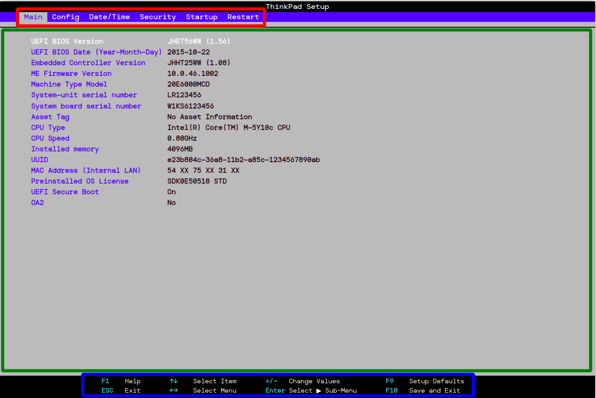
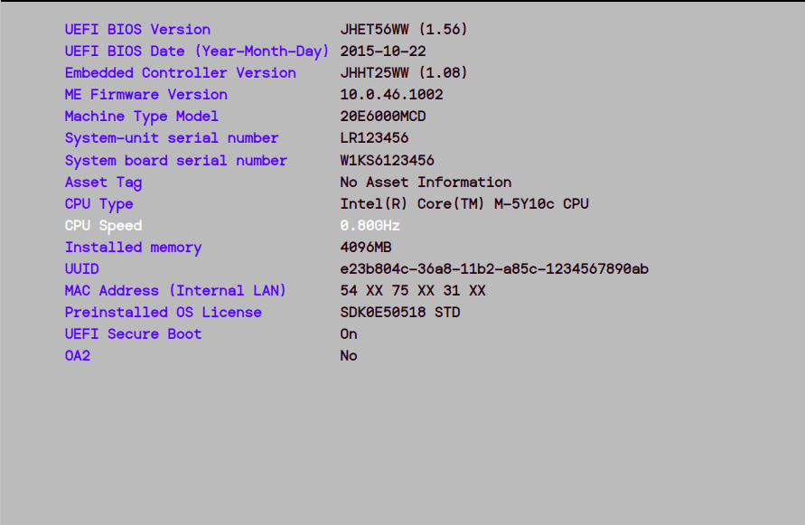
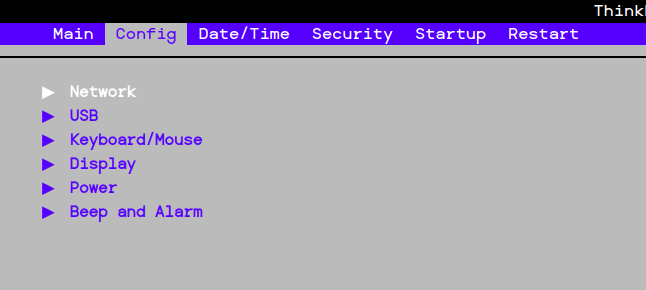
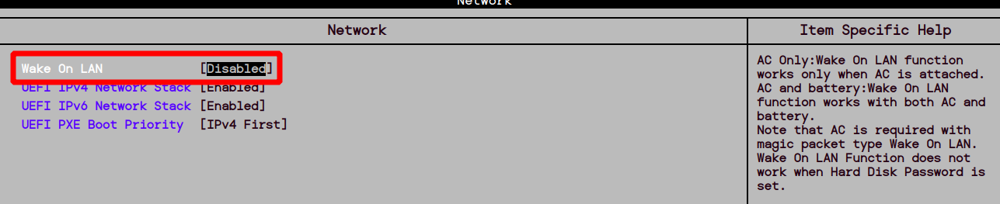
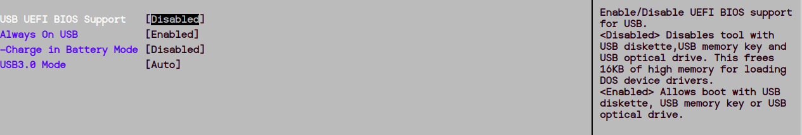
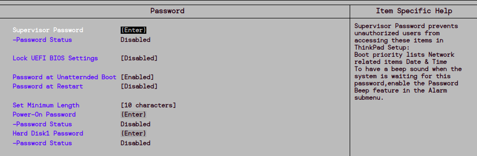
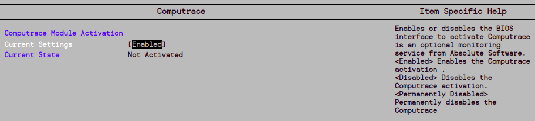
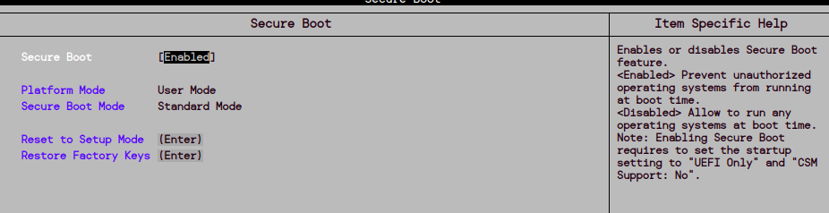

# Bastionado BIOS/UEFI

El bastionado de la BIOS/UEFI es el proceso de asegurar la configuración inicial de un ordenador para prevenir accesos no autorizados. 
Dado que la BIOS/UEFI controla el hardware antes de que arranque el sistema operativo, es un punto crítico de seguridad. 
Bastionarla implica protegerla con contraseñas, habilitar funciones como el arranque seguro (Secure Boot) y desactivar dispositivos innecesarios. 
Esto reduce el riesgo de ataques que intentan comprometer el sistema desde sus niveles más bajos, garantizando un entorno más seguro desde el inicio.

En esta primera parte de la práctica, vamos gestionar una BIOS emulada para hacerla lo más segura posible. En este caso estoy usando la BIOS de un 
portátil lenovo:

Esto es lo que veremos si entramos correctamente en la BIOS de nuestro sistema(puede variar con cada equipo, pero son bastante parecidos)

En esta primera imagen, veremos las pestañas a las que podemos acceder para configurarlas.

En la parte central, podremos ver información u opcciones a configurar, en este caso vemos información de las BIOS con la versión, la fecha, etc; números de serie, mac, velocidad de la CPU...

Y en la parte inferior, tenemos los atajos de teclado que podremos usar en cada momento con su descripción.

## Config

Una vez visto lo *principal* de la BIOS, vamos a pasar ahora a la configuración en busca de hacerla más segura.
Avancemos de pestaña y vallamonos a la de configuración:

### Network

Veremos muchas opciones, voy a centrarme en las más importantes, las que comprometan la seguridad del sistema.
Accedemos a la configuración de la network y cambiamos este parámetro:

De esta forma, evitamos que alguien pueda encender el portátil de manera remota.
El resto podemos dejarlo como está.

### USB

En esta sección, deberemos deshabilitar la opcción de iniciar desde USB:

De esta forma, evitaremos que puedan iniciar un sistema operativo desde un dispositivo externo y sacar o ver información de nuestro sistema.

El resto podemos dejarlo por defecto.

## Date/Time

En esta pestaña no encontramos nada que comprometa la seguridad de nuestro sistema.

## Security

Podríamos decir que esta es la pestaña más importante en cuanto a seguridad se refiere. Podemos cambiar bastantes cosas aquí.

### Password

Al acceder a este apartado, veremos lo siguiente:

Vamos a comentar cada una de ellas:

#### Supervisor password
Esta opción permite poner una contraseña para que usuarios no autorizados no puedan acceder a la configuración de la BIOS.
La habilitamos y ponemos una contraseña segura. ¡OJO!, si la contraseña se olvida, no podrás volver a acceder a la BIOS.

#### Lock UEFI BIOS settings
Previene que los usuarios puedan hacer cambios en la BIOS, si la contraseña del supervisor está activada, esta opción no tiene sentido.
Si no os fiais del paso anterior, esto podría proporcionar una *seguridad* falsa.

#### Password at unatternded boot
Esta configuración obliga a los usuarios a poner la contraseña despues de un apagado completo o una hibernación.
Importantisimo activar, si el sistema entra en estado de hibernación, es porque el usuario principal no está en el
portátil en ese momento, por lo que otra persona podría acceder sin loguearse, activandola evitamos eso.

#### Password at restart
Parecida a la anterior, pero solo cuando el sistema se reinicia.
Podríamos activarlo para tener un poco más de seguridad.

#### Set minimun lenght
Selecciona la longitud minima de la contraseña del supervisor, power-on y disco duro.
Lo más seguro es poner una longitud de 10 en adelante.

#### Power-On password
Evita que usuarios no autorizados puedan iniciar el sistema.
Activar

#### Hard Disk1 password
Evita que usuarios no autorizados accedan a la información del disco duro.
Importantisimo activar.

### Anti-theft
Al entrar en esta configuración, podremos activar el *Computrace*, con el cual podremos rastrear el dispositivo, 
bloquearlo remotamente, borrar los datos y monitorearlo.

Al activarlo se conecta a los servidores de *Absolute Software*, los cuales se encargan de realizar las acciones anteriores.
Lo activamos también.

### Secure boot
En este apartado podremos configurar el arranque seguro del sistema, es decir, prevenir la ejecución de operaciones no autorizadas a la hora de inicio.

Lo activamos también.

## Startup

En esta pestaña podremos configurar el inicio del sistema.
